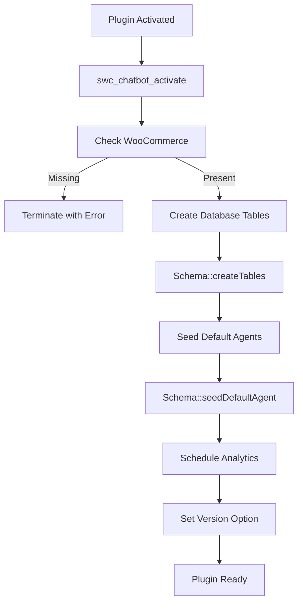
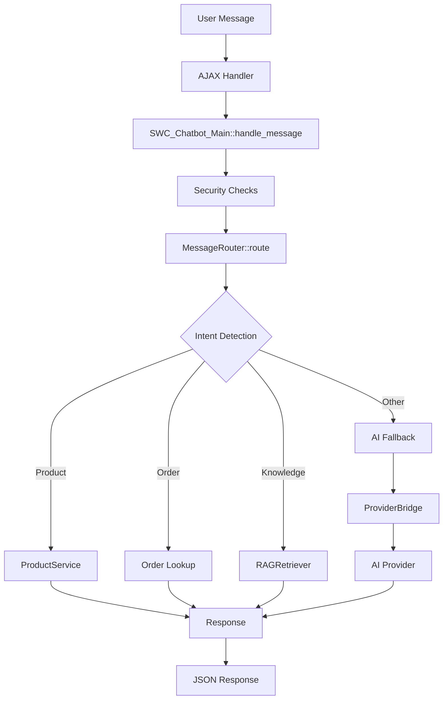
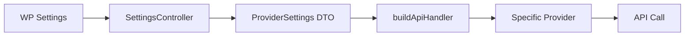
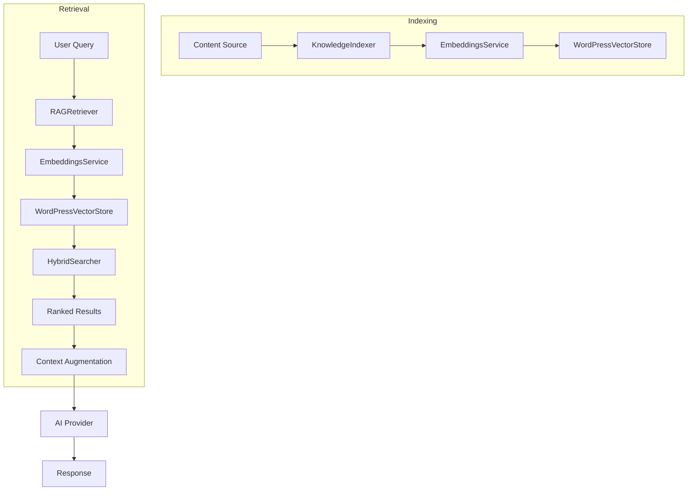
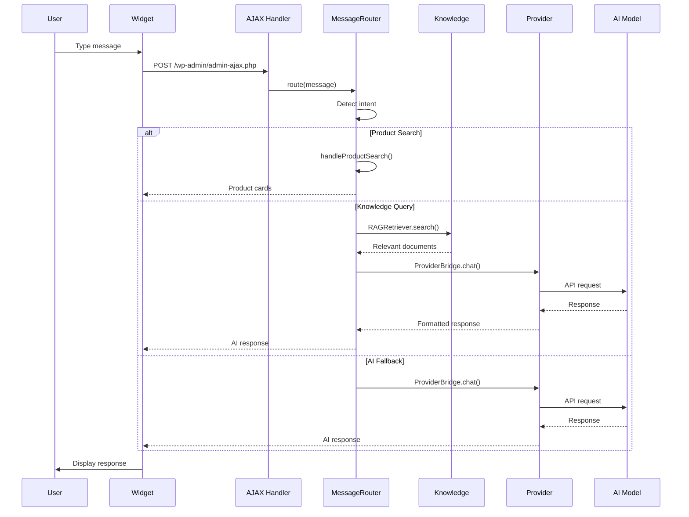
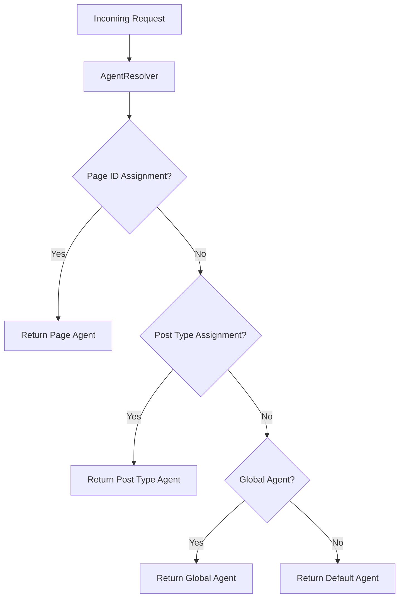

# Smart AI Chatbot - Complete System Architecture

## Table of Contents

1. [Overview](#overview)
2. [System Architecture](#system-architecture)
3. [Plugin Lifecycle](#plugin-lifecycle)
4. [Core Components](#core-components)
5. [AI Provider System](#ai-provider-system)
6. [Knowledge & RAG Pipeline](#knowledge--rag-pipeline)
7. [Agent & Multi-Agent System](#agent--multi-agent-system)
8. [Toolkit & Skill Framework](#toolkit--skill-framework)
9. [Scheduler & Automation](#scheduler--automation)
10. [Analytics System](#analytics-system)
11. [Admin UI (React)](#admin-ui-react)
12. [REST API Reference](#rest-api-reference)
13. [Database Schema](#database-schema)
14. [Frontend Widget](#frontend-widget)
15. [Data Flow Diagrams](#data-flow-diagrams)

---

## Overview

The **Smart AI Chatbot (SWC)** is an enterprise-grade WordPress plugin that integrates AI-powered conversational capabilities with WooCommerce stores. It features:

- **40+ AI Provider Support** (OpenAI, Anthropic, Gemini, Groq, local Ollama, etc.)
- **Multi-Agent Architecture** with page-specific routing
- **RAG Pipeline** for semantic knowledge retrieval
- **102+ Tools** across 15 domains (WooCommerce, WordPress, SEO, etc.)
- **40+ Pre-built Skills** organized in 9 categories
- **Task Scheduling** with cron and recurring schedules
- **Analytics Dashboard** tracking 50+ metrics

### Requirements

| Component | Version |
|-----------|---------|
| PHP | >= 8.1.0 |
| WordPress | >= 6.0 |
| WooCommerce | >= 5.0 |
| Node.js | >= 20 (for UI build) |

---

## System Architecture

```
┌─────────────────────────────────────────────────────────────────────────┐
│                         WordPress Environment                            │
├─────────────────────────────────────────────────────────────────────────┤
│                                                                          │
│  ┌──────────────────────────────────────────────────────────────────┐   │
│  │                  smart-ai-chatbot.php (Entry Point)              │   │
│  │     - Plugin bootstrap, constants, hooks registration             │   │
│  └────────────────────────────┬─────────────────────────────────────┘   │
│                               │                                          │
│           ┌───────────────────┴───────────────────┐                     │
│           ▼                                       ▼                     │
│  ┌─────────────────────┐              ┌─────────────────────────┐       │
│  │   LEGACY LAYER      │              │    MODERN LAYER         │       │
│  │   (includes/)       │              │    (src/)               │       │
│  │                     │              │                         │       │
│  │ • class-chatbot.php │◄────────────►│ • Api/Controllers/      │       │
│  │ • class-admin.php   │   Bridge     │ • Services/             │       │
│  │ • class-woocommerce │              │ • Models/               │       │
│  │ • api-providers/    │              │ • Knowledge/            │       │
│  └─────────────────────┘              │ • Scheduler/            │       │
│                                       │ • Analytics/            │       │
│                                       │ • Bridge/ProviderBridge │       │
│                                       └─────────────────────────┘       │
│                                                                          │
│  ┌─────────────────────────────────────────────────────────────────┐    │
│  │                    React Admin UI (assets/admin-react/)          │    │
│  │   60 components • 7 feature modules • Real-time validation       │    │
│  └─────────────────────────────────────────────────────────────────┘    │
│                                                                          │
└─────────────────────────────────────────────────────────────────────────┘
```

### Directory Structure

```
azi-chatbot/
├── smart-ai-chatbot.php    # Entry point (373 lines)
├── src/                     # Modern PSR-4 layer
│   ├── bootstrap.php        # Module system loader
│   ├── helpers.php          # Utility functions
│   ├── Admin/               # Admin interface
│   ├── Agent/               # Agent core (3 files)
│   ├── Analytics/           # Analytics system (5 files)
│   ├── Api/                 # REST API layer
│   │   ├── Controllers/     # 5 controllers
│   │   ├── Providers/       # 42 AI providers
│   │   └── index.php        # Provider factory
│   ├── Bridge/              # Legacy-modern bridge
│   ├── Config/              # Configuration (6 files)
│   ├── Knowledge/           # RAG system (21 files)
│   ├── Models/              # Database models (5 files)
│   ├── Modules/             # Core modules (3 files)
│   ├── Scheduler/           # Task scheduling (10 files)
│   ├── Services/            # Business logic (10 files)
│   ├── Skills/              # Skill management (13 files)
│   ├── Templates/           # Agent templates
│   ├── Types/               # Type definitions (4 files)
│   └── Workflows/           # Workflow engine
├── includes/                # Legacy layer
│   ├── class-chatbot.php    # Main frontend class (2163 lines)
│   ├── class-admin.php      # Admin settings
│   ├── class-woocommerce.php # WC integration
│   ├── agent/               # Agent system (10 files)
│   ├── api-providers/       # Legacy providers (32 files)
│   └── Database/Schema.php  # Database schema
├── toolkits/                # 15 toolkit domains
├── skills/                  # 9 skill categories
├── assets/                  # Frontend assets
│   ├── admin-react/         # React admin UI
│   │   ├── App.jsx          # Main app (15KB)
│   │   ├── components/      # 60 UI components
│   │   ├── hooks/           # React hooks
│   │   └── styles/          # CSS (16 files)
│   ├── css/                 # Frontend styles
│   └── js/                  # Frontend scripts
└── tests/                   # Test suite (12 files)
```

---

## Plugin Lifecycle

### 1. Activation Flow



### 2. Request Lifecycle



### 3. Bootstrap Sequence

The `src/bootstrap.php` file loads the modern modular system:

```php
// 1. Load interfaces
require_once 'contracts/AgentInterface.php';
require_once 'modules/ModuleInterface.php';
require_once 'modules/ToolInterface.php';

// 2. Load types
require_once 'types/ModelInfo.php';
require_once 'types/ProviderName.php';
require_once 'types/ProviderSettings.php';

// 3. Load provider system
require_once 'api/providers/BaseProvider.php';
require_once 'api/providers/BaseOpenAICompatible.php';
require_once 'api/index.php';

// 4. Load bridge
require_once 'bridge/ProviderBridge.php';

// 5. Load modules
require_once 'modules/ModuleLoader.php';
require_once 'modules/core/CoreModule.php';
require_once 'modules/woocommerce/WooCommerceModule.php';

// 6. Initialize analytics
\App\Analytics\AnalyticsEndpoint::register();
\App\Analytics\AnalyticsScheduler::init();
```

---

## Core Components

### Entry Point: `smart-ai-chatbot.php`

| Function | Purpose |
|----------|---------|
| `swc_chatbot_check_woocommerce()` | Validates WooCommerce is active |
| `swc_chatbot_init()` | Main initialization on `plugins_loaded` |
| `swc_chatbot_load_chat_system()` | Loads multi-agent chat classes |
| `swc_chatbot_ensure_tables()` | Ensures DB tables exist |
| `swc_chatbot_activate()` | Activation hook handler |
| `swc_chatbot_deactivate()` | Deactivation cleanup |

### Legacy Frontend: `class-chatbot.php`

The monolithic 2163-line class handling frontend interactions:

| Method | Lines | Description |
|--------|-------|-------------|
| `__construct()` | 18-41 | Register hooks & actions |
| `enqueue_scripts()` | 43-60 | Load frontend assets |
| `render_chatbot()` | 62-114 | Render widget HTML |
| `handle_message()` | 116-159 | AJAX entry point |
| `process_message()` | 161-1322 | Main message processing |
| `get_ai_response()` | 1324-1638 | AI response with RAG |
| `search_products()` | 1683-1710 | WooCommerce search |
| `ajax_add_to_cart()` | 1927-1940 | Add to cart handler |
| `ajax_add_to_wishlist()` | 2036-2076 | Wishlist handler |
| `ajax_stock_alert()` | 2078-2115 | Stock notification |

### Bridge System: `ProviderBridge`

Located at `src/Bridge/ProviderBridge.php`, this class unifies the 42 providers:

```php
// Unified entry point for all AI communication
$bridge = new ProviderBridge();
$response = $bridge->chat($message, $context);
```

### Services Layer

Located in `src/Services/`:

| Service | Purpose |
|---------|---------|
| `MessageRouter` | Intent detection & routing |
| `AgentResolver` | Resolve active agent for request |
| `OrchestratorService` | Multi-agent coordination |
| `ProductService` | WooCommerce product operations |
| `ContextRetriever` | Gather request context |
| `HandoffService` | Agent handoff management |
| `Logger` | Structured logging |
| `ErrorHandler` | Exception handling |
| `RateLimiter` | API rate limiting |
| `Config` | Configuration management |

---

## AI Provider System

### Provider Factory

Located at `src/Api/index.php`, the factory builds provider instances:

```php
function buildApiHandler(ProviderSettings $settings): BaseProvider {
    switch ($settings->apiProvider) {
        case ProviderName::ANTHROPIC:
            return new Anthropic($settings);
        case ProviderName::OPENAI:
            return new OpenAI($settings);
        // ... 40+ more cases
    }
}
```

### Supported Providers (42 Total)

| Category | Providers |
|----------|-----------|
| **Tier 1 (Cloud)** | OpenAI, Anthropic, Gemini, Groq, DeepSeek, Mistral |
| **Enterprise** | AWS Bedrock, Azure OpenAI, Google Vertex |
| **Routers** | OpenRouter (200+ models), LiteLLM |
| **Fast Inference** | Groq, Cerebras, SambaNova, Fireworks |
| **Specialized** | xAI (Grok), Moonshot, Doubao, MiniMax |
| **Local** | Ollama, LM Studio |
| **Emerging** | DeepInfra, HuggingFace, Featherless, Baseten |

### Provider Class Hierarchy

```
BaseProvider (abstract)
├── BaseOpenAICompatible (for OpenAI-compatible APIs)
│   ├── OpenAI
│   ├── Groq
│   ├── DeepSeek
│   ├── Mistral
│   ├── Fireworks
│   └── ... (many more)
├── Anthropic (custom implementation)
├── Gemini (Google's API format)
├── Bedrock (AWS SDK integration)
└── OpenRouter (routing layer)
```

### Configuration Flow



---

## Knowledge & RAG Pipeline

### Architecture

Located in `src/Knowledge/` with 21 files:

```
Knowledge/
├── RAGRetriever.php          # Main retrieval interface
├── HybridSearcher.php        # Semantic + lexical fusion
├── EmbeddingsService.php     # Vector embedding generation
├── WordPressVectorStore.php  # Vector storage
├── FullTextSearcher.php      # BM25-style text search
├── KnowledgeIndexer.php      # Document indexing pipeline
├── KnowledgeDocument.php     # Document model
├── DocumentRegistry.php      # Document management
├── KnowledgeSource.php       # Source definitions
├── KnowledgeController.php   # REST API (25KB)
├── KnowledgeScheduler.php    # Auto-sync scheduling
├── KnowledgeConfig.php       # Configuration
├── FileUploadHandler.php     # File uploads
├── WordPressDataLoader.php   # WP content loader
├── WordPressHooks.php        # WP integration hooks
├── ContentGapAnalyzer.php    # Coverage analysis
├── ConversationLearner.php   # Learning from chats
├── KnowledgeAnalytics.php    # Usage metrics
├── KnowledgeExporter.php     # Data export
├── KnowledgeAugmenter.php    # Context augmentation
└── SearchKnowledgeTool.php   # Agent tool wrapper
```

### RAG Flow



### Key Classes

#### `RAGRetriever`
```php
class RAGRetriever {
    public function search(string $query, ?int $limit = null): array;
    public function searchWithThreshold(string $query, float $minScore = 0.5): array;
    public function getContext(string $query, int $limit = 3): string;
    public function isAvailable(): bool;
    public function getStats(): array;
}
```

#### `HybridSearcher`
Combines semantic (vector) and lexical (BM25) search with weighted fusion for optimal relevance.

---

## Agent & Multi-Agent System

### Agent Resolution

Agents are resolved by priority:
1. **Page ID** - Specific page assignment
2. **Post Type** - Category-wide assignment
3. **Global** - Default fallback agent

### Models

Located in `src/Models/`:

| Model | Purpose |
|-------|---------|
| `ChatAgent` | Agent definition (name, config, skills) |
| `AgentGroup` | Agent categories/grouping |
| `ChatAssignment` | Agent → Location mapping |
| `ChatSession` | Conversation history |
| `ChatRating` | User feedback/ratings |

### Default Agents

Defined in `src/Config/default-agents.php`:

- General Shopping Assistant
- Product Specialist
- Order Support Agent
- FAQ Expert
- (+ more based on templates)

### Agent Configuration

```php
// From AgentConfig.php
class AgentConfig {
    public string $name;
    public string $systemPrompt;
    public array $allowedTools;
    public array $blockedTools;
    public string $providerId;
    public string $modelId;
    public int $maxTokens;
    public float $temperature;
}
```

---

## Toolkit & Skill Framework

### Toolkits (15 Domains)

Located in `toolkits/`:

| Domain | Files | Description |
|--------|-------|-------------|
| `WooCommerce/` | 23 | Products, orders, coupons, shipping |
| `WordPress/` | 14 | Posts, pages, media, comments |
| `WordPressContent/` | 14 | Content creation & editing |
| `Security/` | 11 | Security scanning, hardening |
| `SEO/` | 11 | SEO analysis & optimization |
| `Performance/` | 11 | Caching, optimization |
| `Forms/` | 14 | Form handling |
| `Integrations/` | 11 | Third-party integrations |
| `FileAccess/` | 12 | File system operations |
| `WebResearch/` | 17 | Web scraping, research |
| `CLI/` | 11 | WP-CLI commands |
| `CustomFields/` | 7 | ACF, meta fields |
| `Expressions/` | 11 | Dynamic expressions |
| `Workflows/` | 2 | Workflow automation |
| `research/` | 6 | Research tools |

### Skills (9 Categories)

Located in `skills/`:

| Category | Skills | Purpose |
|----------|--------|---------|
| `woocommerce/` | 11 | E-commerce operations |
| `admin/` | 8 | WordPress admin tasks |
| `content/` | 5 | Content generation |
| `marketing/` | 3 | Marketing automation |
| `seo/` | 2 | SEO optimization |
| `support/` | 1 | Customer support |
| `compliance/` | 2 | Regulatory compliance |
| `general/` | 2 | General utilities |
| `templates/` | 6 | Agent templates |

### Skill Format

Each skill is a `SKILL.md` file with YAML frontmatter:

```markdown
---
name: product_search
description: Search WooCommerce products with filters
---

## Instructions

1. Use the `wp_product_search` tool to find products
2. Apply filters for price, category, attributes
3. Return formatted product cards

## Examples

User: "Show me red shoes under $50"
...
```

---

## Scheduler & Automation

### Architecture

Located in `src/Scheduler/`:

| File | Purpose |
|------|---------|
| `TaskScheduler.php` | Main scheduler service |
| `TaskRunner.php` | Task execution engine |
| `ScheduledTask.php` | Task model |
| `TaskExecution.php` | Execution record |
| `CronSchedule.php` | Cron expression parser |
| `RecurringSchedule.php` | Recurring schedule logic |

### Agent Scheduling

Sub-directory `Scheduler/Agents/` (4 files) handles agent-specific automation:
- Proactive notifications
- Scheduled responses
- Background processing

### Cron Expressions

```php
// Supported patterns
"*/15 * * * *"    // Every 15 minutes
"0 * * * *"       // Every hour
"0 0 * * *"       // Daily at midnight
"0 0 * * 0"       // Weekly on Sunday
```

---

## Analytics System

### Components

Located in `src/Analytics/`:

| File | Purpose |
|------|---------|
| `AnalyticsService.php` | Main analytics service |
| `AnalyticsRepository.php` | Data access layer |
| `AnalyticsEndpoint.php` | REST API |
| `AnalyticsSchema.php` | Database table schema |
| `AnalyticsScheduler.php` | Daily rollup scheduler |

### Tracked Metrics

- **Usage**: Messages, sessions, unique users
- **Performance**: Response time, error rates
- **Costs**: Token usage, API costs
- **Quality**: Ratings, feedback, resolution rate
- **Tools**: Tool usage distribution
- **Agents**: Per-agent statistics

---

## Admin UI (React)

### Structure

Located in `assets/admin-react/`:

```
admin-react/
├── App.jsx                    # Main application (15KB)
├── index.js                   # Entry point
├── styles.css                 # Global styles
├── components/
│   ├── AgentEditor.jsx        # Agent configuration
│   ├── AgentCard.jsx          # Agent display card
│   ├── AgentList.jsx          # Agent listing
│   ├── AgentSkillAssigner.jsx # Skill management
│   ├── GroupEditor.jsx        # Group management
│   ├── ToolkitManager.jsx     # Toolkit configuration
│   ├── TemplateWizard.jsx     # Agent templates
│   ├── LocationAssigner.jsx   # Page assignments
│   ├── analytics/             # 7 analytics components
│   ├── appearance/            # 6 customization components
│   ├── knowledge/             # 6 knowledge base components
│   ├── settings/              # 2 settings components
│   ├── shared/                # 5 shared components
│   ├── skills/                # 17 skill components
│   └── tasks/                 # 5 task components
├── hooks/                     # 2 custom hooks
└── styles/                    # 16 CSS modules
```

### Feature Modules

| Module | Components | Purpose |
|--------|------------|---------|
| **Agents** | 12 | Create, edit, assign agents |
| **Skills** | 17 | Skill discovery & assignment |
| **Knowledge** | 6 | RAG content management |
| **Tasks** | 5 | Scheduled task management |
| **Analytics** | 7 | Dashboard & reports |
| **Appearance** | 6 | Theme customization |
| **Settings** | 2 | Global configuration |

---

## REST API Reference

### Base URL
```
/wp-json/swc-chatbot/v1/
```

### Endpoints

#### Chat
| Method | Endpoint | Description |
|--------|----------|-------------|
| POST | `/chat` | Send message, get response |
| POST | `/chat/stream` | Streamed response |
| GET | `/sessions` | List chat sessions |
| GET | `/sessions/{id}` | Get session details |

#### Agents
| Method | Endpoint | Description |
|--------|----------|-------------|
| GET | `/agents` | List all agents |
| POST | `/agents` | Create agent |
| GET | `/agents/{id}` | Get agent |
| PUT | `/agents/{id}` | Update agent |
| DELETE | `/agents/{id}` | Delete agent |
| GET | `/agents/{id}/skills` | Get agent skills |
| POST | `/agents/{id}/skills` | Assign skills |

#### Knowledge
| Method | Endpoint | Description |
|--------|----------|-------------|
| GET | `/knowledge` | List documents |
| POST | `/knowledge` | Add document |
| GET | `/knowledge/{id}` | Get document |
| DELETE | `/knowledge/{id}` | Delete document |
| POST | `/knowledge/index` | Trigger indexing |
| GET | `/knowledge/stats` | Get statistics |

#### Skills
| Method | Endpoint | Description |
|--------|----------|-------------|
| GET | `/skills` | List all skills |
| GET | `/skills/{id}` | Get skill details |
| GET | `/skills/categories` | Get categories |

#### Tasks
| Method | Endpoint | Description |
|--------|----------|-------------|
| GET | `/tasks` | List tasks |
| POST | `/tasks` | Create task |
| PUT | `/tasks/{id}` | Update task |
| DELETE | `/tasks/{id}` | Delete task |
| POST | `/tasks/{id}/run` | Run task now |

#### Settings
| Method | Endpoint | Description |
|--------|----------|-------------|
| GET | `/settings` | Get all settings |
| POST | `/settings` | Update settings |
| GET | `/settings/providers` | List providers |
| POST | `/settings/test-connection` | Test provider |

#### Analytics
| Method | Endpoint | Description |
|--------|----------|-------------|
| GET | `/analytics` | Get analytics data |
| GET | `/analytics/summary` | Quick summary |
| GET | `/analytics/costs` | Cost breakdown |

---

## Database Schema

### Tables

Created in `includes/Database/Schema.php`:

#### `{prefix}_swc_agents`
| Column | Type | Description |
|--------|------|-------------|
| id | bigint | Primary key |
| name | varchar(255) | Agent name |
| slug | varchar(255) | Unique identifier |
| description | text | Agent description |
| config | longtext | JSON configuration |
| status | varchar(20) | active/inactive |
| created_at | datetime | Creation timestamp |
| updated_at | datetime | Update timestamp |

#### `{prefix}_swc_agent_groups`
| Column | Type | Description |
|--------|------|-------------|
| id | bigint | Primary key |
| name | varchar(255) | Group name |
| description | text | Group description |
| priority | int | Resolution priority |

#### `{prefix}_swc_assignments`
| Column | Type | Description |
|--------|------|-------------|
| id | bigint | Primary key |
| agent_id | bigint | Foreign key to agents |
| location_type | varchar(50) | page/post_type/global |
| location_id | varchar(255) | Specific identifier |
| priority | int | Assignment priority |

#### `{prefix}_swc_sessions`
| Column | Type | Description |
|--------|------|-------------|
| id | bigint | Primary key |
| session_id | varchar(64) | UUID |
| agent_id | bigint | Active agent |
| user_id | bigint | WordPress user (nullable) |
| messages | longtext | JSON message history |
| metadata | longtext | Session metadata |
| created_at | datetime | Start time |
| updated_at | datetime | Last activity |

#### `{prefix}_swc_scheduled_tasks`
| Column | Type | Description |
|--------|------|-------------|
| id | bigint | Primary key |
| agent_id | bigint | Owning agent |
| name | varchar(255) | Task name |
| type | varchar(50) | Task type |
| schedule | varchar(100) | Cron expression |
| config | longtext | Task configuration |
| next_run | datetime | Next execution |
| status | varchar(20) | active/paused |

#### `{prefix}_swc_task_executions`
| Column | Type | Description |
|--------|------|-------------|
| id | bigint | Primary key |
| task_id | bigint | Foreign key |
| started_at | datetime | Start time |
| ended_at | datetime | End time |
| status | varchar(20) | success/failed |
| result | longtext | Execution result |

#### `{prefix}_swc_knowledge`
| Column | Type | Description |
|--------|------|-------------|
| id | bigint | Primary key |
| title | varchar(255) | Document title |
| content | longtext | Document content |
| embedding | longtext | Vector embedding |
| source_type | varchar(50) | Type of source |
| source_id | varchar(255) | Source identifier |
| metadata | longtext | Additional data |

---

## Frontend Widget

### Rendering

The chatbot widget is rendered by `SWC_Chatbot_Main::render_chatbot()`:

```html
<div id="swc-chatbot" class="swc-chatbot-container">
    <div class="swc-chat-bubble">💬</div>
    <div class="swc-chat-window">
        <div class="swc-chat-header">...</div>
        <div class="swc-chat-messages">...</div>
        <div class="swc-chat-input">...</div>
    </div>
</div>
```

### Frontend JavaScript

Located in `assets/js/chatbot.js`:
- Message sending via AJAX
- Product card rendering
- Order tracking UI
- Voice input integration
- Wishlist/cart actions

### Styling

Located in `assets/css/`:
- `chatbot.css` - Main widget styles
- `chatbot-rtl.css` - RTL support

---

## Data Flow Diagrams

### Message Processing Flow



### Agent Resolution Flow



---

## Best Practices

### Security

1. **Nonce Verification**: All AJAX handlers use `check_ajax_referer()`
2. **Capability Checks**: Admin endpoints verify `manage_options`
3. **SQL Safety**: Use `$wpdb->prepare()` for all queries
4. **Input Sanitization**: All user input sanitized before use
5. **Output Escaping**: All output escaped with `esc_html()`, `esc_attr()`

### Performance

1. **Lazy Loading**: Skills loaded on-demand (85% token savings)
2. **Caching**: Options and queries cached where appropriate
3. **Async Processing**: Long tasks run via Action Scheduler
4. **Database Indexing**: Key columns indexed for fast lookup

### Extensibility

1. **Hooks**: Use WordPress actions/filters for customization
2. **Interfaces**: Implement `AgentInterface`, `ToolInterface` for extensions
3. **Config Files**: External configuration via `default-agents.php`

---

## Troubleshooting

### Common Issues

| Issue | Solution |
|-------|----------|
| Chatbot not appearing | Check WooCommerce is active |
| AI not responding | Verify API key in test connection |
| Slow responses | Try faster provider (Groq) |
| 500 errors | Check PHP error log |
| Knowledge not working | Re-index via Knowledge page |

### Debug Mode

Enable in `wp-config.php`:
```php
define('WP_DEBUG', true);
define('WP_DEBUG_LOG', true);
define('SWC_CHATBOT_DEBUG', true);
```

---

## Version History

- **1.1.0** - Current version with 40+ providers, RAG, multi-agent
- **1.0.0** - Initial release

---

*Documentation generated: January 2026*
*Smart AI Chatbot - Enterprise AI for WooCommerce*
